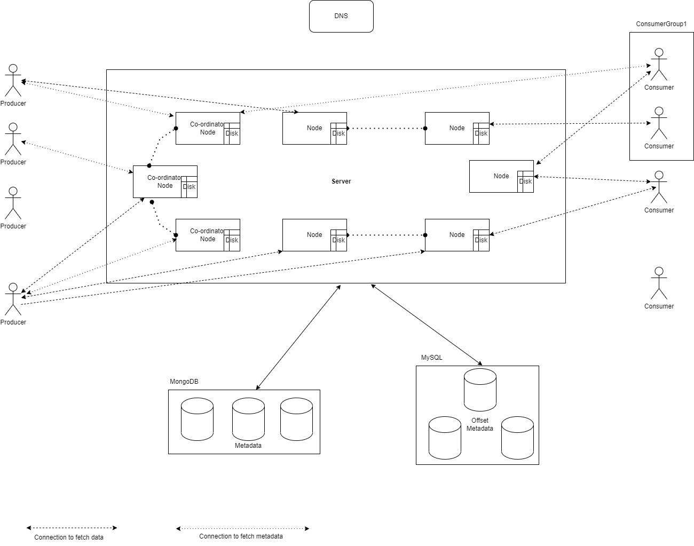

# Publish-Subscribe Architecture

## Motivation
Apache Kafka is a very popular stream processing platform. It is built upon publisher-subscriber architecture and supports use cases involving extremely fast event processing across multiple producers and consumers.

We'll try to build a publisher-subscriber platform similar to Apache Kafka.

## Background

We live in a world where a plethora of applications (service or group of services) work together to achieve high-level functionality (e.g., Paying money using a credit card involves a swipe machine to capture credit card details, processing credit card information by owning authorities, validation by the bank, etc.). A single service is usually built to provide specific functionality. A service can be decomposed into packages, classes and functions. Thus the logic to perform a high-level function is spread across many individual units (or Components). These individual units handle smaller functionalities and communicate with each other to achieve a higher level of functionality.

It should be understood that communication channels are not very robust and hence data exchange could fail at times. The system should consider failure scenarios and be built with consideration of the following:
- To retry communication
- To ensure data persistence until data is consumed by all required processes

There are many ways to exchange data across services (or applications or components). However, there could be factors such as the visibility of a method within a class, deployment across the different physical systems, frequency of data exchange or even the amount of data to be exchanged playing an important role in deciding the proper communication channel and method.

### Scenario

Let's evaluate some scenarios and communication approaches.

For sake of simplicity, let's assume that the system can choose to either transfer data or metadata depending on required features (i.e., size of data, data persistence, etc.).

#### One to One communication
- Data needs to be transferred from one method to another method, which is part of the same package and deployed on the same server.
    - Data can be passed as a parameter to the new method
        - If the system crashes during the exchange, the data being transferred is lost.
    - Data is stored in a memory location and reference to this memory location is passed. It is useful when a huge amount of data is to be transferred across methods e.g. Graph
        - If the system crashes during the exchange, the data stored at the memory location is lost.
    - Data is stored in the file or database and parameters to fetch details are passed to the method
        - Data is persisted across system failures
- Data needs to be passed to a service, as part of a different deployment.
    - If both services exist on the same physical host. An appropriate logic can be used to transfer data using RAM or disk exhibiting similar behavior as in previous scenarios.
    - Data can be exchanged through a network. There could be the involvement of other hosts depending on the location of deployment of both services.
        - Network calls can fail and lead to failure in exchanging data
    - Data can be stored in a database or some storage service and only metadata is communicated to the service. This is helpful in scenarios where data requires persistence or data is processed by multiple services.

#### One-to-many communication
- Data is produced by a single service and consumed by multiple services existing within the same deployment on the same host
    - Data producing class can store a reference to objects consuming this data (Observer design pattern). The producer object loops through consumers objects and invokes consume function and passes the reference data (or metadata in cases where data is stored at the shared memory location or disk or database)
- Data is produced by a single service and consumed by multiple services existing across different deployments on different hosts
    - Similar to the previous approach, remote consumer class objects method invocation can be abstracted as Remote Procedure Call and achieve similar functionality. The actual data/metadata exchange would happen via a network. It should be noted that data is pushed to consumers instead of pulling in this approach.
    - Each consumer can request data via API call to the producer and get data/metadata in the response. It should be noted that data is pulled from the producer in this approach.

#### Many-to-many communication
- Data is produced by multiple services and consumed by multiple services existing within the same deployment on the same host
    - Similar to one-to-many communication, each producer class can act as an Observable class and pass data to consumers.
- Data is produced by multiple services and consumed by multiple services existing across different deployments on different hosts
    - Similar to one-to-many communication, each service class can pass data/metadata to all consumers via a push or pull mechanism.
    - Unlike memory reference, network calls are costly. Data through different producers could be aggregated on a common server (and replicated on a bunch of servers) and sent from server to consumer via a pull or push mechanism. This method acts as if there is only a single producer and thus could drastically reduce network calls.


## Publisher - Subscriber architecture

In Publisher-Subscriber architecture, producers are referred to as publishers since they bring data to the system and consumers are referred to as subscribers as they've subscribed to consume data from the system.

The system would use abstraction to refer to a collection of data published by some producers and refer to it as a topic. So, we can say that different consumers would read data from the topic and different publishers would publish data on the topic. It is also possible that a producer is populating data for multiple topics and similarly a consumer can read data from multiple topics.

In a lot of real-world scenarios, there exists multiple producers (different sources of data) and multiple consumers (different use cases build on data). Moreover, publishers could be publishing data at a different rate compared to the rate at which data is consumed by consumers. e.g., Consider a stock exchange. Many sellers could register their willingness to sell a certain stock at a preferred price. Multiple sellers would be interested in knowing the price at which stock is available for purchase before placing a buy order at a certain target price. 

We'll try to build a system that would act as a central platform to allow data sharing across multiple producers and multiple consumers. This system should allow admins to create a topic to which producers can publish data and consumers can consume data.

Consumers don't share their state with other consumers. However, depending on the task, it is a common requirement that the message is consumed by only one of the consumers among a set of consumers. Our system would allow the formation of a consumer group and ensure that new consumers can be added/removed from this group and guarantee that the message is read by only one consumer in a consumer group. (In cases of failure at the consumer end, it is possible that messages might be consumed by multiple consumers. Our system should guarantee that only a single consumer can commit a successful offset read. Consumers usually consume data and commit reading after they've performed their task.)

Needless to say, the system should be distributed to allow parallel read and write for higher throughput and availability as well as to store huge amounts of data. Data read and write logic should allow for extremely fast read and write across multiple topics by different publishers and subscribers at any time. Also, the system can support managing the state of consumers and consumer groups.

Note: Multiple producer and consumer instances can run on a system allowing it to act as publisher/consumer for multiple topics. It might be possible to add logic to support this feature within a single instance but we'll keep the design simple in the meantime. 


### Functional Requirement:
- Multiple producers should be able to populate data against a topic
- Multiple consumers should be able to produce data from a topic
- A new publisher should be able to publish data against an existing topic
- A new subscriber should be able to subscribe and consume data from an existing topic
- An existing publisher/subscriber can leave the system
- The system should be able to process different rates of data production by producers and different rates of data consumption across consumers
- The system should be able to manage multiple topics

### Non-functional requirements:
- Data should be persisted for the time defined in configuration (e.g., A topic could be configured to store data for 7 days)
- Subscribers should be able to get data via either a pull or push mechanism
- The system should be highly available
- The system should be performant
- The system should be scalable (i.e., nodes in the server can be added or removed)

### Good to have features:
- The system should be able to manage the state of the subscriber (i.e, Store information of last read)
- The system should allow forming a subscriber group so that messages across the subscribers' group are distributed(read by only one subscriber) among subscribers part of it
- The system should allow the creation of different partitions within a topic and allow publishing to desired partition. Partition could be used to balance the incoming load from publishers. 
- The system would also maintain the order of publishing messages within a partition (i.e., incoming messages within a partition could be accessed sequentially).

Note:
- The system would not support idempotence for message delivery as it might happen that a consumer received a message but crashed before processing it hence it'll be the responsibility of the consumer to ensure it processes a message only once even if the same message is delivered multiple times.

### High-level working
The system consists of multiple nodes spread across different geographies. During the process to onboard topics on the system. The system would analyze nodes for details such as geography, free space, topics onboarded etc. and allocate partitions to various nodes and assign them as a leader or follower.

Publishers would be able to connect to specific leader nodes for publishing data corresponding to a specific topic and partition. The system would update offset as well as update replicas.

Consumers would connect to the system as a part of consumer groups and subscribe to topics. The system would distribute topics and partitions among consumers (This act is called rebalancing and would occur depending on the configuration of consumer groups). Consumers would connect to leaders or followers of topics and partitions assigned to them and poll to read some message from a specified offset and update the last read offset on the server once their read is successful.

### APIs
POST /topic
- Create a topic by providing details such as name, number of partitions, replication
GET /topic
- Receive a list of all topics
PUT /topic/{topicId}
- Publish a message into a specific partition of a topic
POST /subscribe/{topicId}
- Subscribe to a topic as a member of a specific consumer group and obtain a list of topics and partitions assigned to self within the consumer group
GET /topicId/{partitionId}/{offsetId}/{count}
- Read messages from a partition of a topic starting from offsetId
POST /topicId/{partitionId}/{offsetId}
- Update last read offset on a partition i.e., commit offset value
GET /topicId/{partitionId}/{offsetId}
- Get the last read offset on a partition

We'll not discuss APIs for security, heartbeat, node rebalance, synchronization and other management APIs for sake of simplicity.


### Database
Storage is required for:
- Metadata such as topics
- System data about the state of various topics, consumers and server nodes
- Store data produced by producers

Each onboarded topic to the system would have details such as topicName, topicId (auto-generated), number of partitions and details of leader (main node) and
follower (replica node) for each partition. These details change very rarely e.g., Leader and follower information would change when a node goes down.

Most of these details are generated at once during topic onboarding and changes occur very rarely. The data can be aligned in a hierarchical form as shown below and stored on a read-heavy system. The data looks like a JSON document and could be managed efficiently on a database such as MongoDB.

```JSON
{
    "topicId": int,
    "topicName": string,
    "partitions": 
    [
        {
            "partitionId": int,
            "leader": Node,
            "followers":[Node]
        }
    ]
}
```

During the process of onboarding a topic, the system would require node statistics such as geography, free space, numberOfTopicsOnboarded, etc. These details would be added or updated during node addition and removal from the system or the addition of new topics. The details corresponding to each node on the server are needed for partition allocation and hence would be read completely, which means that storing entire data as a document would be a good choice, allowing to read/update data all at once. Updates would happen rarely or quite infrequently (topic addition is not a very frequent action) and even data reading is quite infrequent in this case.

Node statistics information can be stored in the following manner; To store the state of consumers, the system would store details corresponding to consumer groups. Since the details of all consumers within a group are needed for the allocation of topics and partitions, the following details can be stored together.

```JSON
{
    "consumerGroupId": int,
    "topics": [],
    "consumers": [],
    "allocation":
    [
        {
            "topicId": int,
            "partitionId": int,
            "consumerNode": Node
        }
    ]
}
```

Consumer nodes are less reliable and could be much more frequently updated. Hence, the above data could have a decent number of updates (still it'd be a single-digit update in a matter of minutes and not much). However, each consumer would update the read offset very frequently. The data to manage read offset could be organized as follows:

|ConsumerGroupId|ConsumerNode|TopicId|PartitionId|Offset|
|---|---|---|---|---|
|c123|con1|top14|part1|12456|
|c123|con2|top14|part2|13245|
|c124|con3|top14|part1|11111|

Any database supporting frequent writing would be a good choice. (We can use slow-write databases as well. It'd involve the use of the Cache, Write ahead log and Batch update). 

Finally, we need to decide on the storage of data written by publishers. The data to be written by various publishers could be partitioned and brought to a considerable write threshold. We'll still try to maximize write throughput. Instead of using a database, we'll work with files directly on the system and only append to a file. Each append operation would increase file size and OS would help in allocation and writing to the file. Each time a file needs to be resized to support new data, an increment to file size could be done in a block of some size (e.g., 128MB), making it easier to store data corresponding to the same file at a contiguous location, thus supporting fast read and write.

Instead of writing entire data (of specific topic and partition) to one file, it could be broken down into multiple files with a max size limit on file. A convention such as a fileName.part00001 can be used to create file chunks.

Overall, the system would try to write data to a file. If there is no space available within the file, it would be increased by some size (e.g., 128MB) if the new size fits within the max size limit or the system would create a new file part and write data to it. Some additional metadata or logic is needed to work with file parts, the simplest logic would be to store a list of all parts corresponding to the file and a reference to the last part. Details like minOffset and maxOffset could also be stored corresponding to the file part.

### Back-of-the-envelope calculation

The approximate load on the system would vary a lot depending on the use case. If a system is used for private purposes within an industry, it'll typically have lower loads compared to public shared service handling many clients. 

The following approximation should be good for a private industry and okayish for a shared public infrastructure.
- 1M topics
- 10 partitions in each topic
- 10M producers
- 0.1M consumer group
- 1M consumers

Using table details from the database section, we can calculate approximate storage and throughput values. 

#### Metadata storage analysis
- Topic Details
    - 1M (topics)* 700B (approx details for a topic) ~ 700 MB

- Node Details
    - Node details storage requirement would grow as more nodes are included in the system. However, depending on various calculated values, we can decide the number of nodes in the system. It's like a chicken and egg problem.
    
    - To start, let's assume that the system has approximately 100 nodes. Assuming an equal load, each node would handle 0.01M topics as the leader and 0.01M * (replicationFactor-1) topics as followers. Let's assume replication factor = 3.

    - Storage requirements: 0.01M (topics) * 3 (replicationFactor) * 50B (details corresponding to each topic) + 0.01M (topics) * 50B (node details) ~ 1.5MB

- Consumer Details
    - We've two tables. One to store details of consumers and allocation within consumer groups and another to store offset details.
    - Consumer Group details: 0.1M (consumer group) * 50B (allocation detail) * 1 (topic subscribed by consumer group) * 10 (partitions) ~ 5MB
    - Offset Details: 1M (topics) * 10 (partition) * 40B (data in each row) ~ 400MB

#### Data storage analysis
The number of messages produced by producers, message size, replication factor and data retention policy greatly impact data storage requirements. Events such as "clicks" i.e., Reaction on a post/tweet, View product details, etc. have small message sizes but a large number of events. On other hand, processing of data in the ETL pipeline - such messages could be large but less frequent.

Generally, message sizes are 1KB (but they could be as large as 1MB). Very frequent events could be as high as 1M/second (only lasts a few seconds) hence we'd use an average of 1K events/second per topic in the calculation.

1M (topics) * 1K (events/sec) * 86400 (data is available for 1 day) * 1KB ~ 86400TB/day

It's a lot of data. Since very few topics produce 1K events/sec, let's further split topics and events frequency to get a more accurate result.

1K (topics) * 1K (events/sec) * 86400 * 1KB + 10K (topics) * 0.1K (events/sec) * 86400 * 1KB + 100K (topics) * 0.01K (events/sec) * 86400 * 1KB + 899K (topics) * 1 (event/sec) * 86400 * 1KB ~ 86.4TB/day

Let's not forget that system has 100 nodes to handle this storage and also manage a replication factor of 3. Roughly every node would store 86.4TB*3/100 ~ 2.5TB/day. Data retention is usually less for events producing data at a faster rate. From the above calculation, the system is adding 2.5TB of data each day when the data retention period is 1 day. If data needed to be stored for more days, the storage would also grow in its multiple.

#### Throughput analysis
- Producer throughput
    - As discussed earlier, the rates of producing data could vary a lot depending on the event.
    - In the case of live events such as a cricket match, a lot of people from various devices could be sharing their reactions to the current status of the match. 1M or even more people could be predicting the winner (and consumer processing these events need to update live win prediction.)

    - 1M (producers) * 1 (message per second) * 10KB (message size) = 10MB/s. Assuming this topic has 10 partitions, data is spread over 10 nodes. The resulting throughput per server is 1MB/s.

    - Most use-case doesn't have a lot of producers producing data simultaneously. Let's consider an average scenario:
    - 1K (producers) * 10 (message per second) * 10KB (message size) = 100MB/s. Throughput across each node would be ~10MB/s.

- Consumer throughput
    - Events requiring heavy processing usually have more consumers so that lots of messages can be processed in parallel for time taking process. Whereas, quick-to-process events have less number of consumers. On average, a consumer would process; 1 (topic) * 5 (partitions) * 1K (messages/sec) * 10KB (message size) ~ 50 MB/s. It is very unlikely that the consumer is reading all data from a single node. The average throughput on each server would be ~10MB/s due to one such consumer.

- Server throughput:
    - 1M (topics) * 1K (events/sec) * 10 KB(message size) / 100 (servers) ~ 0.1TB/s. Again, 1M topics wouldn't be simultaneously producing 1K events/s. Replacing 1M with 1K gives a better approximation of 100MB/s.

    - In the case of live events (i.e., heavy load scenario), producers and consumers would be producing and consuming data almost instantly. So, input to the server would be at 100MB/s and output from the server would also be 100MB/s.

Note: We've considered that there are 100 servers in our system. In case, the system scales to handle more than 1M topics/producers/consumers, the number of server nodes would also be scaled to keep throughput values within the limit and deliver similar results as with 1M topics/producers/consumers.


### Architecture

#### Server
The server contains nodes with two kinds of responsibility.
- To process metadata from nodes, producers and consumers and redirect to the correct leader node
- To process data from producer and send data to consumer

These functionalities can be present on the same or different set of servers. If there are too less coordinator nodes, the metadata information produced during the addition or removal of a node or creation of a topic might not get processed (If all nodes are down!). If there are too many coordinators, the time taken to achieve consensus would be high (It is possible to use the RAFT algorithm for consensus and make all processes run as coordinators). This feature can be configured by the system administrator depending on factors such as location, network, SLA etc. In the HLD diagram, it is assumed that a set of servers from all servers act as coordinators and all nodes in the server act as data nodes.

#### DNS
DNS contains IPs of co-ordinator nodes and acts as a load balancer.

#### Data Flow
The Producer fetches IP from DNS and connects to a coordinator node. It fetches details of all nodes associated with a topic and catches it locally. Producer determines the partition of a message and sends it to the leader node for the corresponding topic and partition.

The node receives the message and verifies if it intended recipient and if is the leader for the corresponding topic and partition. If it is the intended recipient, it stores the message in the file on disk and sends data to follower nodes and responds to the producer depending on acknowledgment configuration.

A consumer node registers itself as a part of a consumer group with a coordinator node. Depending on the configuration, partitions might be assigned to it immediately or with delay. Once a consumer node knows the details of the partition, it communicates with the corresponding data node to fetch data from a specific offset. After reading the data, the consumer node requests the node to update the offset. (Consumer node also stores offset value locally after fetching it initially so that subsequent requests can be made without re-fetching offset value).

#### Topic Creation
A new topic creation request along with required details such as partition count is received at one of the coordinator nodes. This node fetches node statistics and tries to allocate nodes for each partition as leader or follower and shares allocation details with other coordinators and updates database entries.

#### Cache
Metadata details such as leader/follower nodes for topic and partition combination are stored in the local cache after fetching it for the first time from the database. The cache is updated using a read-through mechanism and uses the LRU eviction policy.

#### Recovery
In case of a consumer node failure, one of the existing nodes can be promoted as a coordinator node. This newly promoted node would sync with another coordinator to update itself with relevant details.

In case of a data node failure, one of the follower nodes will be promoted to the leader and a new follower node would be assigned immediately or with delay (as per configuration). Once the new follower node is assigned, it'll update itself with messages from the leader or other follower node.

#### Persistence
Data is stored on the internal disk of the leader node along with replication on follower nodes. All write requests are processed on several nodes configured by the producer to receive an acknowledgment. To guarantee a higher chance of persistence, data should be acknowledged from multiple nodes on each write. The chances of all these nodes failing together is extremely low and thus provide a higher chance of persistence.

#### Data Purging and Archival
Messages are immutable and hence can be considered for compression. However, it should be noted that uncompression would be required later (either on the server or the consumer) to retrieve the original data.

The system stores data in a queue-like structure. The offset value increases in each newly added file and within the file, the offset value increases sequentially. During the purge, the system can simply delete the file if the offset timestamp is beyond the maintenance range or sequentially iterate through the file and partition it and later delete chunks corresponding to old data. Purge operation can be time-consuming involving multiple disks reading and writing. It should be performed as a scheduled batch operation.

#### Pull vs Push Mechanism
The producers push messages to the server and consumers pull data from the server. The push mechanism on the producer allows the system to receive produced messages as soon as it is ready to be delivered by the producer. However, in the case of consumers, the push mechanism could lead to an issue when the rate of consumption by the consumer is slow compared to the rate of data published by publishers. Consumers would become overwhelmed and might not be able to store and process further messages. Another challenge could be pushing data to an offline consumer, the system would require an immediate rebalance to ensure continued processing by the consumer group but this leads to another issue of too frequent rebalance (Processes with large processing consumes data at a slow rate and prefers to have large time before a rebalance is initiated.)

#### Diagram


### Bottleneck

With an increase in the number of topics, throughput value would increase and after a certain value would reach unrealistic levels. The system needs to add new nodes during scaling to distribute load across nodes.

Scaling down the system is challenging as topics are distributed across nodes. To bring down a node, data from multiple topics needs to be synced to an existing node before a node can be safely removed from the system. A similar situation occurs when a node fails, and one of the follower nodes becomes a leader and ensures availability, a lot of data sync could be required to replicate data to an existent node to bring back the system to configured leader/follower specification.

In case of uneven distribution of topics with heavier writes, the disk of a node could get full quickly with no space left to write new data. In such cases, the disk capacity of nodes needs to be increased after 80% of disk space is used to ensure smooth operations.

### Benchmarking and Monitoring
The state of nodes in the system needs to be monitored in real-time. Different health check end-point can be set up to either pull or push healthy node information to co-ordinator nodes in the system.

The system also needs to keep a check on disk usage and perform disk increments or purges or archival to increase free space on the disk. Old data should be purged promptly to avoid unnecessary disk increment operations.

### Security
Each producer and consumer needs to be authenticated and authorized for data access on a topic and assigned a session key which can be verified by the data node before sharing data with the producer or consumer.

Access to the data node must be authorized by a coordinator node. The coordinator node would have a full mechanism of authentication and authorization as it acts as a public interface. Data nodes can be streamlined security setup and guarantee access to only nodes authorized by one of the coordinator nodes.
 
### Low-level design

We'll create an in-memory system consisting of multiple producers and consumers. Unlike distributed system where producers, consumers, and coordinators would exist on a different physical system, this system would instead have producers and consumers running in different thread. Threads would interact with each other via a function call (these function calls could be updated to use APIs internally and thus act like RPC).

The LLD is based on Service-Oriented Architecture i.e., Main functions are present in a service class (Classes exist within the services directory). Similar to services, the interfaces directory contains Interface classes, domain directory contains Classes to create Objects for storing values and communication between services.

#### Features:
The following set of features is available:
- Create a new topic
- Create multiple producers to publish messages
- Create multiple consumers to consume messages
- Consumers could be grouped under consumerGroup for load balancing

The following features are partially implemented and could be refactored and coded to configure via a configuration file.
- Consumers consume a message only once
- Consumers manage offset in the local cache
- A central offset store is also available

#### Class Diagram


TopicManager serves as a central entity and stores details of all topics (TopicManager resembles one of the coordinators in distributed implementation). DataManagers acts as a storage component (DataManager resembles a data node in a distributed system). DataManagers registers itself with TopicManager, which assigns the responsibility of storing data as new topics get created. OffsetStore stores committed offset against consumerGroup (OffsetStore would act as one of the components of coordinators to store consumer/consumerGroup state). AllocationManager is used by TopicManager to manage allocated topics and partitions to consumers within a consumer group.

#### Overview

An instance of TopicManager is created. Multiple instances of DataManagers are created, and they register themselves with TopicManager.

Topics are onboarded to the system using TopicManager. For a topic, details such as topicName and numberOfPartitions are provided (Replication is not included for simplicity). During the topic onboard stage, topicManager distributes the responsibility of managing different partitions to DataManager (Here, a random offset is used to balance load among dataManagers, any other more useful detail could also be used). It should be noted that TopicManager is a singleton class (created using @Service Spring Annotation). However, DataManagers are not singleton as they need to store details of specific partitions only. In different instances of DataManagers, different data would be stored unlike TopicManager, which would essentially store the same data. To further extend this idea, TopicManager is created as a singleton so all instances share the same data without additional effort. (In a distributed environment, TopicManagers would coordinate with each other to ensure they remain in sync).

The message is a key-value store for data. The key is also used for partitioning by Partitioner. RecordProducer stores metadata such as TopicDetail and construct enriched message (i.e., Record) by adding partition, topicName and timestamp. Records are published to stores using producers.

Producers and Consumers can be created (Each in a thread of its own, to work in parallel). Producers simply transfer a record (message details along with metadata such as topicName, partition, and timestamp) to the concerned DataManager for storage. Consumers connect with TopicManager and register themselves as a member of some consumer groups with AllocationManager. Consumer requests a reallocation of topics allocated to its consumer group and gets details of partitions for data consumption. Consumers poll for data to DataManager, which returns a null or valid record depending on the availability of data.

While producers and consumers all work in parallel, a single instance of dataManager processes writes requests in sequential form. Consumers from different Consumer Groups can read data from the same DataManager in parallel.

#### Design Principles
- Use of Interface wherever appropriate to keep the system loosely coupled.
- A similar pattern as Observer to register Consumers and DataManagers and receive updates from AllocationManager and TopicManager respectively.
- Classes sharing their state in all instances are created as singleton.
- Stateless Producer. A pool of producers can be created and reused instead of spawning a new thread or an instance.
- Use of Threads to parallelize processing.
- Code is structured in a way that allows easy refactoring to break into different applications and integration of APIs to enable working on a distributed infrastructure.

#### Miscellaneous
- Offsets are managed locally by consumers. However, there exists a global OffsetStore which could be used by a new consumer on receiving an existing partition from a failed consumer to get to the correct offset.
- Some amount of logging and sleep is added to Producer and Consumer classes for illustrative purposes. Their values can be adjusted to demonstrate different behavior on reallocation, fast or slow production and consumption.
- Classes used as a key in HashMap have overridden equals() and hashCode() methods.
- Classes used as a key in TreeMap implement the Comparable interface and have overridden the compareTo() method.

#### Code
Code is written in Java (17) and uses Gradle for the build. SpringBoot framework is used to keep code simple and easily extend to use ORM/Database/APIs. Exception Handling/Logging/Telemetry is not included.

#### Testing
A sample code is available in the test class. It instantiates classes and Threads. Several topics are created and DataManagers register themselves with TopicManager. Several Producer classes populate DataManagers with messages across all topics and partitions (The producer class has sleep added in send method to control the speed of data publishing). Several Consumer classes register themselves with TopicManager and request a re-allocation of partitions among currently available consumers within ConsumerGroup (The consumer class has sleep added in consume method to control the speed of consumption). Consumer classes stay active for 10 seconds before a thread is stopped. The main thread stops execution once all threads have completed their tasks.
