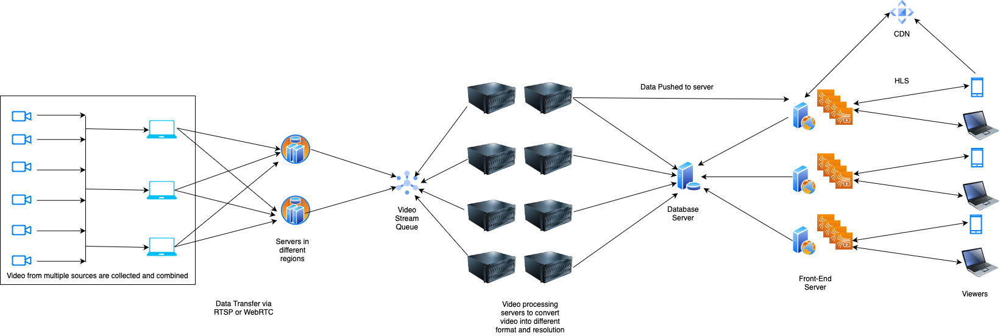

# Stream Video

Video streaming is a very common technology used by various service providers to allow their customers to watch various live or recorded content.
Watching a video stream of activity happening somewhere across the globe allows many people to enjoy as well as participate in it, even if they are miles away.

We'll try to build a system to provide a video streaming service. It will allow a content provider to upload/stream a video (it would be a real-time video or an earlier recorded video) to our system. Viewers can connect to our streaming service to watch the content as it is being uploaded.

## Flow of video from source to viewer
1. Cameras at the event would act as a source. 
2. Data from different sources could be combined with other information (e.g., the commentary is added in a sports event or captions are added) and then sent to our streaming service. 
3. Our streaming service would process the video and make it available in various configurations. 
4. Viewers should be able to connect to our server and choose a configuration and play the video.

## Requirements

Our video streaming service should be able to receive video and related information, perform the processing and allow viewers to watch it in real-time. We should understand that different viewers might view the stream on different devices (in different resolutions and video formats). Also, the network connectivity could change dynamically, so our stream should be adaptive to allow viewers to watch content depending on their bandwidth and network strength.

It is also possible that a viewer joined the stream late or that a viewer couldn't see the stream due to disconnection and would like to view the earlier portion. We might have to store the data to allow viewing of prior information.

The content provider might prefer to customize the video based on geolocation or other properties e.g., providing language and subtitles in the regional language of the viewer.

Since we're concerned only to build a simple video streaming service i.e, supporting only a single live stream, we'll focus only on essential functional and some of non-functional requirements. We might discuss some of the other functionalities and changes to support it.

Based on the details mentioned earlier, we can categorize the requirements as follows. 

### Functional Requirements 
- A content provider should be able to stream or upload video to a server.
- Viewers should be able to watch the stream.
- Different video types should be supported for uploaded videos.
- Viewers should be able to play video in different media players or browsers (i.e., multiple video format support).
- Viewers should be able to choose video resolution as per their device specification, network etc. (i.e., multiple resolution support).

### Non-Functional Requirements
- The video should be available to viewers in real-time i.e., very less time difference between the video uploaded by the uploader and the video available on the viewer's device (Performant & Minimum Network lag).
- Video streaming services should be highly available.
- Video should be persisted to allow viewing past timeline during live stream.
- Video encoding and decoding should be fast.
- Viewer should be able to view live stream with minimal delay.

### Good to have features
- Viewers can move back and forth in the uploaded stream.
- Support caption.
- Support streaming multiple videos.

## APIs
- POST /upload/{videoId}
    - The content provider uploads a segment of the video stream.
    - The API body might have additional details e.g. Segment Number.
    - Each video segment is uploaded in a new API call.

- GET /viewstream/{videoId}?timestamp&format&resolution&lang
    - Viewers can view a segment from the stream which contains given timestamp corresponding to video-id in the specified format, resolution, language etc.

- GET /viewstream/metadata/{videoid}
    - This API can be used to retrieve meta file containing video format, resolution, etc. details required for playback using HTTP Live Streaming protocol.
    - HTML5 video client is rich in terms of functionality and contains relevant logic to use meta files to get relevant video links and playback segements continuously on viewer's device to give an experience of video stream (while in reality, it plays multiple video segments one after another). 

## Estimation

We'll estimate data upload, download and processing without considering duplication. Duplication factor can be applied wherever required as appropriately to get more realistic estimate.

- Video data written on Server
    - Uploaded video is in full HD (i.e., 1920 * 1080 pixels)
    - Video streams averages to 4 hours
    - Uploaded video is at 30 frames per second
    - Total raw video size on server: 1920 * 1080 (resolution) * 30 (fps) * 3 Bytes (Color) * 4 * 60 * 60 (seconds) ~ 2.7 TB raw data.
- Videos are usually compressed. If the uploaded video is compressed at a bitrate of 0.5MB/s. Hence total video size is 0.5MB/s * 4 * 60 * 60 s ~ 7 GB Compressed data over 4 hours. In order to avoid single point of failure, the data would probably be uploaded to at-least 2 servers. However, each server would only process 7GB of upload.

- Video throughput at server during upload is 0.5MB/s, which is same as bitrate of compressed video.

- To support streaming in different format and resolution, video is converted appropriately. Considering, we want to support .mp4, .webm, .mov formats and 480p, 720p and 1080p, the overall data corresponding to different formats at specified resolution would be:
    - 480p: 3 (formats) * 0.125 MB/s * 4 * 60 * 60 s ~ 5.3 GB compressed video
    - 720p: 3 (formats) * 0.25 MB/s * 4 * 60 * 60 s ~ 10.6 GB compressed video
    - 1080p: 3 (formats) * 0.5 MB/s * 4 * 60 * 60 s ~ 21 GB compressed video
    - Overall, ~37 GB of compressed data would be produced from uploaded video (7 GB) to support different format and resolutions.

- Input video throughput is 0.5MB/s. Processed video throughput across all formats and resolutions is roughly 5 times input i.e., 2.5MB/s. While, the modern computers easily process similar amount of data, it should be noted that logic required to convert video from a resolution to another can involve many intermediate processing before producing final output of 2.5MB processed data from 0.5MB input data.

- Converting video requires a lot of processing power and it'd be beneficial to do it on different systems ideally. 3 formats * 3 resolution = 9 servers. However, depending on CPU/GPU configurations, it'd be possible to process multiple resolutions in parallel on same server. (CPU/GPU should be benchmarked to decide appropriate requirements).

- Data is streamed to viewer in almost real-time. However, considering that some users can have one-way latency as much as 1s, each data packet should atleast be 2s or larger in size (Otherwise, for users with high latency, the next packet would arrive after previous packet is completely played thus leading to buffering.) Generally, a video segment of 5-10s is preferred to reduce metadata, latency issues while also allowing almost real-time streaming.

- Video data read from server
    - Assuming 100M users are watching the stream.
    - Very few users (with slow connection) would be watching stream in 320p, most of users would view on mobile or laptop (720p) and remaining few users would watch stream in 1080p. Let's consider 720p as average resolution for 100M users.
    - Data streamed to user: 100M (users) * 0.25MB/s (bitrate corresponding to 720p) * 4 * 60 * 60 s ~ 335.7 PB 
    - Assuming the content is delivered from 1000 servers, data streamed from each server is ~ 343.75 TB

- Data throughput from a server streaming video to user: 343.75 TB / (4 * 60 * 60 s) ~ 25GB/s. Servers usually have a bandwidth of 1.25 GB/s (i.e., 10Gbps), so we need (25/1.25) * 1000 server; i.e., 20000 servers.
- We don't really want to have these many servers and would offload the data to CDN, thus servers would only be required to upload data to CDN or to provide metadata to user, which would take a lot less data compared to above calculated values. It is also possible that servers are connected to high bandwidth network (100Gbps) and thus number of servers required would be 2000 as per above calculation.

- From above calculation, we can finalize:
    - We need powerful CPU/GPU to convert video in real-time. Assuming each server is dedicated to specified resolution and format, 9 servers are required in our use-case. However, to avoid single point of failure, we'd also keep 3 servers for each video resolution-format conversion and thus require 27 servers for processing video data.
    - We need servers for streaming data. 2000 servers with 100Gbps connection or equivalent combination of server and CDN would be required to stream enormous amount of data.
    - A lot of data streamed to user would be live content and thus probably be present in server cache (Overall video data is only 37GB, easily fits within limit of 64GB ram available on most servers).


## Database

We need a database to store video segments thus allowing users to go back in stream as well as to ensure persistence in case of server failure. As per above estimate, we'd store a video segement of 5s length for each format and resolutions.

- Average size of video segment: 0.25MB/s (birate of 720p video) * 5s = 1.25MB
- Number of video segements: 3 (format) * 3 (resolution) * 4 * 60 * 60s (total video length) / 5s = 25920

We have many files averaging around 1.25MBs for storage. Since, it's a video content, we'd need a blob storage. Amazon S3 or Azure Blob Store seems to be a good choice. However, we could also use MongoDB (Appropriate choice would be based on performance, storage space, availability and cost). It might even be a wise choice to create own storage service to optimize further!

As already discussed in estimate, data is written only once and would only be required to read thereafter. Hence, database should be optimized for read. Data availability in various geographies and low cost for usage are points for consideration to choose a suitable database.

We also need to store metadata information of available video segments alongwith format and resolution details to allow adaptive streaming. This data is very minimal and can be stored in a RDBMS or document database or even as a pre-created file (Assuming S3 as storage, bucket could be created in advanced for a stream, file-id corresponding to each segments could be added as a dummy entry and actual file available after processing can be uploaded to same dummy entry). It should be noted that during live stream, most of data would actually be served from server cache or CDN and there'd be extremely limited database read-write requests from client perspective.

## High-Level Design

### Overview
At a top level, the entire process can be broken down into following sub-process:
- Video and audio data captured via Cameras and sent to local computer for processing.
- The local computer combines data from various cameras into a single video, adds commentary and subtitles and encodes video; multiple video segments are created here from video stream.
- The local computer uploads video segments to our server.
- Our server processes received data, creates required metadata and video files to support different resolution and devices.
- Viewer requests metadata and video file from server and decodes video and play it.

### Details


The captured content on uploader's camera is a continuous video (raw data). The continuous video is basically a set of ordered frames (images) along with audio samples. This raw data can be encoded on camera (new cameras support encoding or even streaming) or shared with a computer or an HDMI interface. This computer receives data from different cameras (multiple angles) and would combine data from these sources to generate a single combined video. Video stream can also be enriched by addition of audio (commentary/music) or subtitles, etc. The raw data is sent to encoder to create video segements from stream, as well as compress data and convert it to supported format for upload on server.

The encoded video files are uploaded to server via a REST API. Each file upload request would also upload metadata and file, thus the end-point should allow body in http request; POST API. Data uploaded in a single request isn't a lot as per earlier analysis thus data can be sent in binary format over a HTTP request. However, in case of a large file, multi-part file upload mechansim can be used. Multiple POST requests from client would keep on uploading the latest video segment to the server. It should be noted that appropriate logic is in place to ensure delivery of video segments in required order with retry mechanism to handle failed transfer. The client and server connection can be a TCP oriented connection on HTTP to ensure all segements reach server in an orderly manner. Moreover, unlike a normal HTTP request, where session is establishes for each request; specialized protocols can be used to benefit from persistent session, mechanism for content-delivery with retries and ordering.

> Realtime Streaming Protocol (RTSP) is a popular protocol used to send data from client to server ensuring specified requirements. However, this protocol has limited reach and dedicated setup might be required on client and server. Another popular protocol HLS (HTTP Live streaming) is available by deafult on most viewers device, however, it has it's own fallacies such as high latency.

The data received on server needs to be converted into different resolution and format. This is a compute intensive process and hence different systems can be used in parallel. Data can be stored in a shared storage and message queue can be used to notify systems to execute conversion process on newly added video segment. Each video processing server, would encode and decode data as required for performing required conversion and also create/update and store it in storage server and use message queue to update about successful video conversion.

A microservice can process successful video conversion messages to create/update metadata files required for video streaming.

> HLS video streaming relies on m3u8 files containing details of video resolution, format, etc. and lists a newtork location to another m3u8 or video file. The second level m3u8 file contains video segement details.

The metadata files and video files are required data for serving video stream to viewers. A viewer would request the server to get metadata file and eventually get the video file and play it on client device. In order to server millions of viewers, there would be multiple servers to process viewers requests to get metadata file. The actual video content can be served from one of API from server or storage or CDN.

### Video lag
Instead of streaming raw data from camera, there are several encoding, decoding, compression and chunking process involved to make streaming more compatiable and to provide smooth video playback.

There could be processing delay at source as combining data from different cameras, adding commentary and subtitles would take some time. It could be nearly 0s, and usually less than 10s.

Raw data can't be streamed to viewers due to network constraints (Please refer to estimation section). Thus, processes such as compression, conversion adds to delay. The encoding process compresses data (to reduce size and achieve easy trasfer over limited bandwidth) and needs time for the same. While the conversion process is needed to support different format and resolution.

The video segementing process also adds a clear delay of X seconds in order to create a video of X seconds length (i.e., Wait to receive data of X second and then wrap it in a single file). 

Lastly, the client device doesn't plays the latest available video segment as it'd lead to buffering since next video segment isn't immediately available on client device after current live segment ended. Client devices usually keeps 1 or 2 next segments in buffer to overcome this delay in network transmission or any unexpected network change.

Overall, assuming 2s lag at source, 5s lag due to segementing and 5s lag due to encoding at server and 5s lag at client would make the video played to viewer with a lag of 17s.

> A way to reduce this lag would be to use hardware accelerated encoders and smaller segements.
> Instead of live-stream, a more interactive session such as meeting or remote desktop requiring sub-second latency utilizes protocol to stream directly from source to destination computers (bypassing servers) and performing minimal encoding and decoding, that too at near real time.

### Cache
The servers would mostly be serving same data to various viewers. Based on estimation, storing entire video stream requires around 37GB space and can easily fit in RAM of 64GB capacity. Thus, in case of server serving video data to client, the data can be returned quicky from RAM instead of fetching it from storage.

Client's device would also cache next video segements in buffer thus providing a smooth video playback experience.

### Network & Protocol
A lot of data transfer is involved, along with requirement of low latency so that videos can be viewed in real-time. One of the things worth considering in live system is a scenario where network transfer failed and decide on retrying sending failed packet (if it is still of relevance) or to send the latest data. Either way, network related issues would lead to significant degradation in user experience.

The system relies on mixed TCP and UDP approach to ensure data availability e.g, the content from uploader would be via UDP protocol to ensure latest data stream is available for serving to viewer; another TCP connection at same time would ensure all data packets are available so any viewer looking at past event might still view the video which was skipped in live stream.

It should also be noted that multiple network connections can be used as appropriate e.g., on viewer's device, two separate connection can handle fetching metadata and fetching video simultaneously. 

The mechanisms of uploading data from source to server can be simplified by use of Real Time Streaming Protocol (RTSP). Similarly, the mechanism involved in playing video at viewer's device can be simplified by use of HTTP Live Streaming (HLS). The proposed system uses HLS due to it's compatiability with large number of devices as well as use of Adaptive Streaming.

### Availability
The proposed system has duplication at all levels to ensure continuous streaming. The data from source is uploaded to multiple servers, thus ensuring server receives data for streaming. The data processing unit also has backup to pick up data from message queue if the leader/active node is unavailable. The processed data is replicated across multiple servers, CDNs across various geographies to stream data smoothly to viewers.

### Scaling
The proposed can be scaled easily at each stage; similar to discussion in Availability section. Primarily, the viewer base might be the major factor determining scaling requirements. A new server can be spun up to serve content from storage; the server might take some time initially to load data from storage and share with viewers but with time, it'd create local cache and stream data faster.

New video format and resolution can be easily supported by adding a system to listening to message queue and process added video segements to required format and resolution and update storage and metadata.

Storing the data on CDNs across various regions of high viewership would ensure that data is served from close point and thus reduce latency as well as bandwidth requirements across unutilized network path.

The system can also be scaled to support functionality to stream multiple live events by creating a unique id for each video stream. Video content such as movie can also be served to user with existing setup; wherein user uploads the segements from the video instead of live stream.

### Bottleneck
The proposed system shows video with a lag of 17s to end user from actual time of occurence of event. This can be a critical issue for some live events requiring user interaction e.g, First person to give correct response to a question asked on the show; A person viewing on device would get the question after 17s compared to audience sharing this information with others via a phone call.

### Monitoring
To understand the system requirements and upscale or down-scale, monitoring at appropriate stages would be helpful. The system should capture metrics of currently connected users and average request-response time on server serving content to viewers.

Setting up video processing servers in a live-live configuration would ensure quick identification of failure and provide quick remedy by allowing other server to take over all requests.

### Content protection
To prevent users from storing and playing back video illegally, the video segments can be encrypted and require a license key to encrypt the video on the fly for playback.

This would require setting up mechanism for authenticating users, encrypting video and strong decryption key on a license server and a trusted video client to perform decryption of video on the fly without storing fully decrypted video on user's device.

Widevine is a popular Digital Rights Media (DRM) standard and has a supported html5 video player.

However, it might not be compatible with all web browsers and may require clients to have one of required OS and Browser combination to support playback.

## Building a Simple Video Streaming Service
Let's start with a recorded video and stream it. Once we've built and understood tid-bits of video streaming, we'll get on to live streaming.

### Streaming a video

#### Requirements
Certain software/libraries would be required in the process.
- [FFMPEG](https://ffmpeg.org)
    For video processing. It'll be used for encoding and decoding video into required format and resolution.
- Python
    To create a server and serve playlist and video files.
    Note: This tutorial uses python3. Python2 can also be used with appropriate commands.
- [Video](https://download.pexels.com/vimeo/201243523/pexels-pixabay-855132.mp4?fps=23.98&width=1280)
    A recorded video which will be streamed. (Please use the sample video from resorces for this tutorial to understand the process and later try with your own video.)

#### Process

The overall process is as follows:
- Store Video files in a directory.
- Use FFMPEG to create segments of large video as well as playlist file (m3u8).
- Create a HTML to play video in browser.
- Serve contents of this directory using python server.

#### Create a directory and store video file in it
- Create a directory *VideoStreaming*.
- Paste a video (mp4) file here. (If you're working with different than mp4 format, please change extensions accordingly.)
- Rename the video file to vid1.mp4

#### Use FFMPEG to create playlist
- Open a new terminal and cd into *VideoStreaming*.
- Execute following command to create a playlist.
    ```shell
    ffmpeg -i vid1.mp4 -codec: copy -start_number 0 -hls_time 10 -hls_list_size 0 -f hls vid.m3u8
    ```
    You should see several *.ts file have been created. Each video segment is roughly around 10s length. There'd also be a vid.m3u8 file.

- Open M3U8 file in a text editor. It's content should be similar to following (There can be more or less segements).
```m3u8
#EXTM3U
#EXT-X-VERSION:3
#EXT-X-TARGETDURATION:13
#EXT-X-PLAYLIST-TYPE:EVENT
#EXT-X-MEDIA-SEQUENCE:0
#EXTINF:12.012000,
http://localhost:9000/vid0.ts
#EXTINF:9.009000,
http://localhost:9000/vid1.ts
#EXTINF:9.009000,
http://localhost:9000/vid2.ts
#EXTINF:12.012000,
http://localhost:9000/vid3.ts
#EXTINF:9.009000,
http://localhost:9000/vid4.ts
#EXTINF:9.009000,
http://localhost:9000/vid5.ts
#EXTINF:0.667378,
http://localhost:9000/vid6.ts
#EXT-X-ENDLIST
```

- #EXT-X-PLAYLIST-TYPE tells about type of streaming.
    - VOD means m3u8 file (i.e, playlist) won't change.
    - EVENT means m3u8 file (i.e, playlist might update with new information).
- #EXT-X-ENDLIST tells that no new segment would be added.

#### Create a HTML file 
Create an HTML file (video.html) with contents as below. The HTML page only contains a video element which has it's source set to playlist file generated in earlier step. (The playlist file is served from server; which will be created in next step.)

Note: Support for native HLS is limited e.g., Safari, Chrome Android supports it while Chrome Desktop, Edge doesn't supports it. Hence, we're using a 3rd party library to support our video streaming across different browsers.

```HTML
<html>
    <head>
        <meta charset="UTF-8">
        <title>VideoStreaming</title>  
    </head>
    <body>
        <video id="video" width='480px' height='360px' controls autoplay>
        </video>
    </body>

    <script src="https://cdn.jsdelivr.net/npm/hls.js@latest"></script>
    <script>
    var video = document.getElementById('video');
    var url = 'http://localhost:9000/vid.m3u8';
    if (Hls.isSupported()) {
        var hls = new Hls({
            debug: true
        });
        hls.loadSource(url);
        hls.attachMedia(video);
        hls.on(Hls.Events.MANIFEST_PARSED, function () {
            video.play();
        });
    }
    </script>
</html>

```

#### Start Python server
- Open a terminal/CMD and cd into *VideoStreaming*.
- Start a python server at port 9000. This would start serving contents from *VideoStreaming* directory.
    ```shell
    python3 -m http.server 9000
    ```

#### Testing video streaming service
Launch a browser and enter following in address bar (http://localhost:9000/video.html).
Playing the video would play the entire video and not just a single segment.
You can launch developer tools and inspect to see several files getting downloaded as video plays.

### Live Streaming
We won't be deep diving into entire live streaming as that'd take lot of effort. Instead, we'd work out on the changes in live streaming vs streaming to understand the difference and test it out.

We already have a video split into several segments and a playlist (m3u8) containing details of all segments.

A live streaming keeps on creating new segements and updates playlist file. So, we simply want to add new video segments and update playlist file with relevant information.

Instead of adding new files, let's remove some of existing data so that we can add the same later on. The playlist file shared above has 7 segments, remove all except first 3.

The updated playlist file is:
```m3u8
#EXTM3U
#EXT-X-VERSION:3
#EXT-X-TARGETDURATION:13
#EXT-X-PLAYLIST-TYPE:EVENT
#EXT-X-MEDIA-SEQUENCE:0
#EXTINF:12.012000,
http://localhost:9000/vid0.ts
#EXTINF:9.009000,
http://localhost:9000/vid1.ts
#EXTINF:9.009000,
http://localhost:9000/vid2.ts
```

Open the developer console and switch to Network tab; we'd track changes to playlist from here.
Launch the [webpage](http://localhost:9000/video.html) or simply refresh. You'd see that the video length is only 30s. 
The request to load m3u8 file, would also show the playlist file as above.

Play the video.
You can see several request to load video segments, however m3u8 file remains same and video would end at 30s.

Let's replay the video and add new segments data while video is playing and has not ended.
Update the playlist file by adding segments details. It should look as follow:
```m3u8
#EXTM3U
#EXT-X-VERSION:3
#EXT-X-TARGETDURATION:13
#EXT-X-PLAYLIST-TYPE:EVENT
#EXT-X-MEDIA-SEQUENCE:0
#EXTINF:12.012000,
http://localhost:9000/vid0.ts
#EXTINF:9.009000,
http://localhost:9000/vid1.ts
#EXTINF:9.009000,
http://localhost:9000/vid2.ts
#EXTINF:12.012000,
http://localhost:9000/vid3.ts
#EXTINF:9.009000,
http://localhost:9000/vid4.ts
#EXTINF:9.009000,
http://localhost:9000/vid5.ts
#EXTINF:0.667378,
http://localhost:9000/vid6.ts
```

Save the file and check browser. 
The video length would get updated to 1m in few seconds.
Also, you can see the request to fetch m3u8 would have response containing new added segment data.
Let the video play and it should play new added video segments as well.

### Creating your own live stream from a video recorder
We've already seen the process of adding new video segments and updating m3u8 file allows us to live-stream.

In order to achieve real-time live stream from a capture device, you need to store the video segments created from camera or any application to the storage location and create a process to update the playlist file whenever a new video segments gets added.


### Troubleshooting
In case you launched video.html page directly from directory instead of [server](http://localhost:9000). You'll have to enable CORS to allow playlist and other files to be loaded.

### Enable CORS
- [Chrome](https://chrome.google.com/webstore/detail/allow-cors-access-control/lhobafahddgcelffkeicbaginigeejlf)
- [Safari](https://stackoverflow.com/questions/4556429/disabling-same-origin-policy-in-safari)

## References
- https://eyevinntechnology.medium.com/internet-video-streaming-abr-part-1-b10964849e19
- https://eyevinntechnology.medium.com/internet-video-streaming-abr-part-2-dbce136b0d7c
- https://eyevinntechnology.medium.com/internet-video-streaming-abr-part-3-45ff4bb3d436
- https://en.wikipedia.org/wiki/IP_camera
- https://developer.apple.com/documentation/http-live-streaming/event-playlist-construction#
